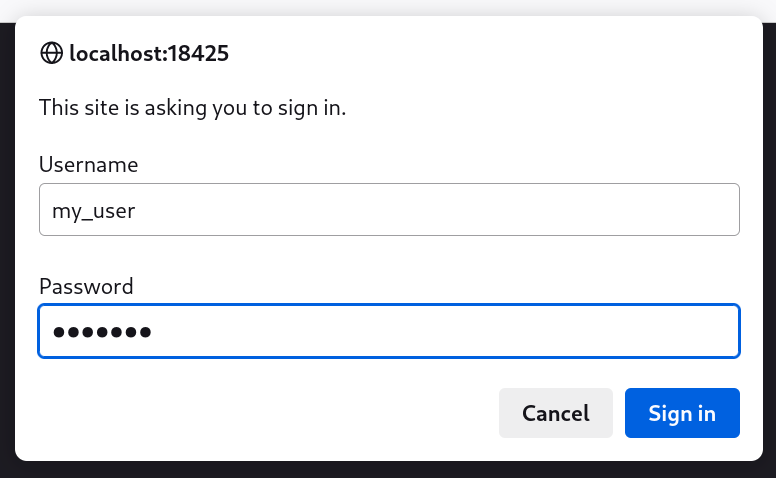

# Authorization
`festivald` has a [`Basic access authentication`](https://en.wikipedia.org/wiki/Basic_access_authentication) option in its [configuration](/config.md), with a username + password setup.

An optional bypass is available on specified [`JSON-RPC` methods](json-rpc.md), [`REST` resources](../rest/rest.md), and documentation.

If `authorization` is enabled, `festivald` will only process connections to it that have the "authorization" HTTP header with this username and password (unless specified in the bypass options).

TLS must be enabled for this feature to work or `festivald` will refuse to start.

However, there are cases where `authorization` without TLS is okay (reverse proxy, [`Tor Onion Service`](/tor.md), etc). In these cases, the [`confirm_no_tls_auth`](/config.md) option will allow `authorization` without TLS.

If `festivald` is started on `localhost` (`127.0.0.1`), it will allow `authorization` without TLS as well.

`authorization` can either be set in the [config](/config.md) file or passed via a [command-line flag](../command-line/command-line.md).

## Syntax
The username & password syntax is specified in [RFC 7617](https://en.wikipedia.org/wiki/Basic_access_authentication).

The "authorization" value must be:
1. The username
2. Followed by a single colon ":"
3. Then the password

For example:
```
my_user:my_pass
```

A request including this information looks like:
```
curl -u my_user:my_pass https://127.0.0.1:18425
```
or the equivalent `wget` command:
```
wget --user my_user --password my_pass --auth-no-challenge https://localhost:18425
```
or the equivalent `festival-cli` command:
```
festival-cli -u my_user -p my_pass https://localhost:18425
```

Alternatively, you can input an absolute PATH to a file `festivald` can access, containing the string, e.g:
```
authorization = "/path/to/user_and_pass.txt"
```
In this case, `festivald` will read the file and attempt to parse it with the same syntax, i.e, the file should contain:
```
my_user:my_pass
```

## RFC 7617
Note that `curl`, `wget` and `festival-cli` all follow [`RFC 7617`](https://datatracker.ietf.org/doc/html/rfc7617), as in, they craft their HTTP `authorization` header to be:
```plaintext
Basic <user:pass in base64>
```
So these commands:
```bash
# Curl
curl -u user:pass https://localhost:18425

# Wget
wget --user=user --password=pass --auth-no-challenge https://localhost:18425

# festival-cli
festival-cli -u user:pass https://localhost:18425
```
sends this as the HTTP `authorization` header:
```plaintext
Basic dXNlcjpwYXNz
```

If you are creating a client for `festivald`, you must do this for authorization as well.

## Web Browser
If connecting to `festivald` via a web browser, you will receive a visual prompt for authorization:


